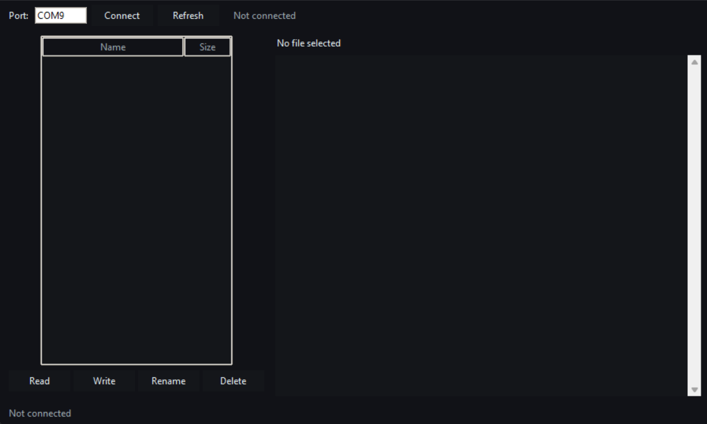

# Arduino EEPROM File System

Simple desktop GUI and arduino code to use your eeprom as a file storage method.
Can contain a max of 900 bytes - 3 files of 300 bytes each.
Practically useless, but fun project.

## Demo

